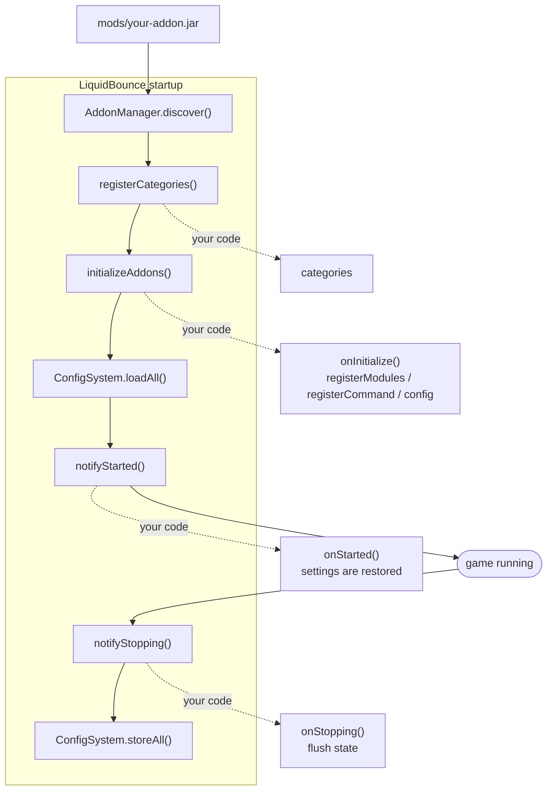

## Manifest and Lifecycle

### fabric.mod.json

An add-on is described by its `fabric.mod.json`, like any Fabric mod. What LiquidBounce reads from it:

```json
{
  "schemaVersion": 1,
  "id": "example-addon",
  "version": "${version}",
  "name": "Example Addon",
  "description": "An add-on template for LiquidBounce add-ons.",
  "authors": ["You"],
  "contact": {
    "homepage": "https://liquidbounce.net/",
    "sources": "https://github.com/CCBlueX/LiquidBounce-Addon-Template",
    "issues": "https://github.com/CCBlueX/LiquidBounce-Addon-Template/issues"
  },
  "license": "GPL-3.0-or-later",
  "icon": "resources/example-addon/icon.png",
  "environment": "client",
  "entrypoints": {
    "liquidbounce": ["com.example.addon.ExampleAddon"]
  },
  "mixins": ["example-addon.mixins.json"],
  "accessWidener": "example-addon.accesswidener",
  "depends": {
    "minecraft": ">=${minecraft_version}",
    "fabricloader": ">=${loader_version}",
    "fabric-language-kotlin": ">=${fabric_kotlin_version}",
    "liquidbounce": "*"
  },
  "custom": {
    "liquidbounce": {
      "color": "#FF5555"
    },
    "modmenu": {
      "parent": "liquidbounce"
    }
  }
}
```

| Key                          | Description                                                                                                  |
|------------------------------|--------------------------------------------------------------------------------------------------------------|
| `id`                         | The add-on id. Names the add-on's folder under `resources/`, its logger and its default config file.          |
| `name`                       | Shown by `.addon info`, available as `displayName`.                                                          |
| `version`                    | Shown by `.addon list` and `.addon info`.                                                                    |
| `description`, `authors`     | Shown by `.addon info`.                                                                                      |
| `contact`                    | `homepage`, `sources` and `issues` are available through `metadata`. `.addon info` shows `sources`.          |
| `icon`                       | The mod icon, for example in Mod Menu. Keep it under `resources/<id>/`.                                     |
| `entrypoints.liquidbounce`   | The class extending `LiquidBounceAddon`. An add-on without it is loaded by Fabric but not by LiquidBounce.   |
| `mixins`, `accessWidener`    | See [Mixins and Access Wideners](/docs/add-on-api/mixins-and-access-wideners).                               |
| `depends`                    | `liquidbounce` makes Fabric refuse to start without the client. The Marketplace also reads `minecraft` and `liquidbounce` from here, see [Publishing](/docs/add-on-api/publishing). |
| `custom.liquidbounce.color`  | A hex color (`#RRGGBB` or `#AARRGGBB`), available as `color`.                                                |
| `custom.modmenu.parent`      | `liquidbounce` lists the add-on under LiquidBounce in Mod Menu.                                              |

### Resource files

Everything the add-on ships besides code goes into `src/main/resources/resources/<id>/`: translations under `lang/`, the mod icon, category icons.

Never use `assets/<id>/`. Fabric registers every mod jar as a resource pack, so anything under `assets/` becomes part of Minecraft's resources, where anything that inspects the loaded resource packs can see it. LiquidBounce reads the `resources/` folder from the jar directly.

### Lifecycle



The entrypoint is constructed while the client discovers add-ons. `metadata` and everything read from it, such as `id` and `logger`, is only available once the constructor has returned, so use them from the hooks and not from property initializers. Add-ons run in the order of their ids.

| Member           | When                                                                                                      |
|------------------|-----------------------------------------------------------------------------------------------------------|
| `categories`     | Read for every add-on before any `onInitialize()`, see [Categories](/docs/add-on-api/categories).         |
| `onInitialize()` | Register everything here. Runs before configs are loaded, so only what exists now gets its settings restored. |
| `onStarted()`    | After configs are loaded. Settings hold their stored values from here on.                                 |
| `onStopping()`   | Before configs are written back to disk.                                                                  |

```kotlin
object ExampleSettings : ValueGroup("General") {
    val greeting by text("Greeting", "Hello")
}

class ExampleAddon : LiquidBounceAddon() {

    override fun onInitialize() {
        config(tree = mutableListOf(ExampleSettings))
    }

    override fun onStarted() {
        logger.info("Greeting is '${ExampleSettings.greeting}'")
    }

    override fun onStopping() {
        logger.info("Shutting down")
    }

}
```

When `categories`, `onInitialize()` or `onStarted()` throws, the add-on is marked as errored and everything it registered through the functions below is withdrawn again. The client and the other add-ons keep running. An exception in `onStopping()` is logged, nothing is withdrawn.

### Registering

Register through the add-on, not through `ModuleManager` or `CommandManager` directly, so a failing add-on can be withdrawn.

| Function                                     | Registers                                                                                     |
|----------------------------------------------|-----------------------------------------------------------------------------------------------|
| `registerModules(vararg modules)`            | [Modules](/docs/add-on-api/creating-modules). `unregisterModules` removes them again.         |
| `registerCommand(registrar)`                 | A [command](/docs/add-on-api/creating-commands).                                              |
| `registerCommandNodes(nodes)`                | Prebuilt Brigadier `LiteralCommandNode`s.                                                     |
| `registerCategory(category)`                 | A [category](/docs/add-on-api/categories) that is only known at runtime.                      |
| `registerMode(parent, mode)`                 | A mode in an existing `ModeValueGroup`, for example the modes of a built-in module.           |
| `registerListeners(vararg listeners)`        | Nothing new; tracks [event listeners](/docs/add-on-api/events) so they are unregistered on failure. |
| `registerBrowserBackend(provider)`           | A [browser backend](/docs/add-on-api/browser-backends).                                       |
| `registerMarketplaceHandler(type, handler)`  | Takes over subscribed Marketplace items of one type. Runs once the subscriptions are loaded, and after every install, update or removal. |
| `config(name, tree)`                         | A config file of its own for the given value groups, `<name>.json` (lower case) in the LiquidBounce folder. `name` defaults to the add-on id. |

[HUD components](/docs/add-on-api/hud-components) are registered through `HudComponentManager` and are not withdrawn.

### Properties

| Property      | Type             | Description                                                                 |
|---------------|------------------|-----------------------------------------------------------------------------|
| `id`          | `String`         | From `fabric.mod.json`.                                                     |
| `version`     | `String`         | From `fabric.mod.json`.                                                     |
| `authors`     | `List<String>`   | From `fabric.mod.json`.                                                     |
| `description` | `String`         | From `fabric.mod.json`.                                                     |
| `color`       | `Color4b?`       | `custom.liquidbounce.color`, `null` when missing or unreadable.             |
| `displayName` | `String`         | `name` from `fabric.mod.json`. Open, can be overridden.                     |
| `metadata`    | `AddonMetadata`  | All of the above, plus `homepage`, `sources`, `issues`, `origin` (the jar's path) and `findPath(path)` for files in the jar. |
| `state`       | `AddonState`     | `DISCOVERED`, `LOADED`, `ERRORED` or `DISABLED`.                            |
| `logger`      | `Logger`         | A Log4j logger named `LiquidBounce/Addon/<id>`.                             |

The add-on is an [event listener](/docs/add-on-api/events) itself. Its handlers run while its state is `LOADED`. It also has the Minecraft shortcuts every module has: `mc`, `player`, `world`, `network`, `interaction` and `inGame`.

```kotlin
object ChatLogger : EventListener {

    @Suppress("unused")
    private val chatHandler = handler<ChatReceiveEvent> { event ->
        println(event.message)
    }

}

class ListenerAddon : LiquidBounceAddon() {

    override fun onInitialize() {
        registerListeners(ChatLogger)
    }

}
```

### Disabling add-ons

The JVM argument `-Dliquidbounce.disableAddons=<id>,<id>` skips the listed add-ons, `-Dliquidbounce.disableAddons=all` skips every one. A skipped add-on is constructed but none of its hooks run, and its translations are not loaded. `.addon info` shows it as `DISABLED`.
