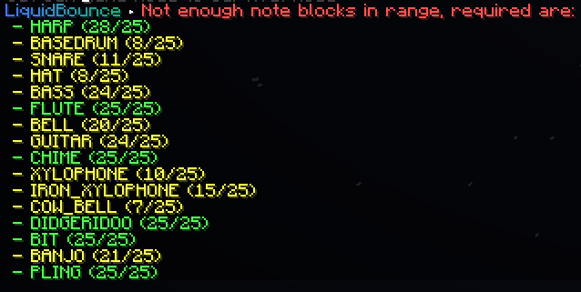

# NoteBot Tutorial

NoteBot is an utility that allows players to play real-world songs using in-game Note Blocks. It reads .nbs (Note Block Song) files and interacts with blocks at high speeds to recreate melodies.

# How to Use
Locate NoteBot within the Fun Menu at ClickGUI.
→ See [Using the ClickGUI](/docs/get-started/usage/clickgui)
Select an .nbs file from your computer using the song selection line.
Toggle the NoteBot module, wait for module to test the blocks and tune for music. Then it will play the song automatically when it's done.

# Notes & Limitations
Block Distance: You must be within "Reach" distance (6 blocks) of the Note Blocks.
Server Latency: High ping or aggressive Anti-Cheats may cause kicks due to high packet frequency.
Creative Mode: This module cannot be used in Creative Mode because hitting a Note Block while in Creative will instantly break it, preventing the module from functioning.
Block Obstruction: Note Blocks cannot have any blocks placed directly on top of them; otherwise, they will not produce any sound.

#  Possible Errors
Insufficient Note Blocks: If the loaded .nbs file requires more notes than those available around you, the song will not start, the module will automatically disable itself, and the required numbers of instruments will be listed in the chat.

# Instrument Test
By downloading , you can see how many instruments and which specific notes are currently around you.

# Ready-to-go World for most NBS Tracks
You can download  to play almost all of the in-game compatible NBS Tracks (Thanks to @GorkemYakar for creating this masterpiece)